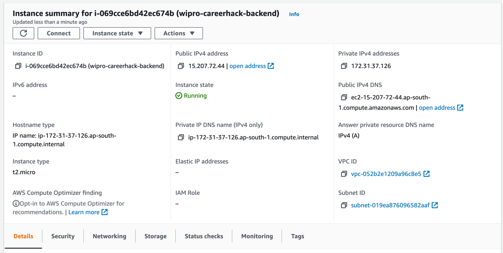
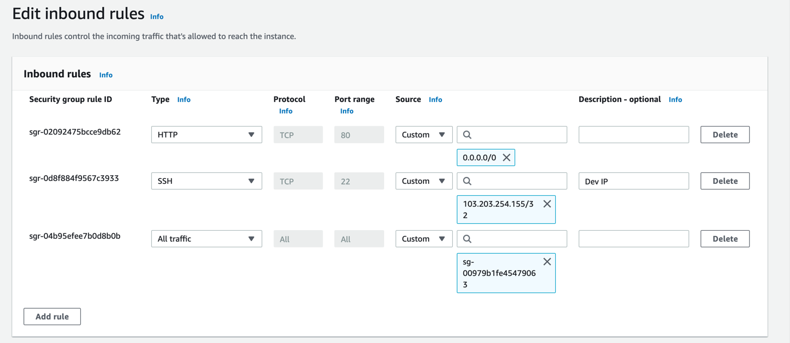
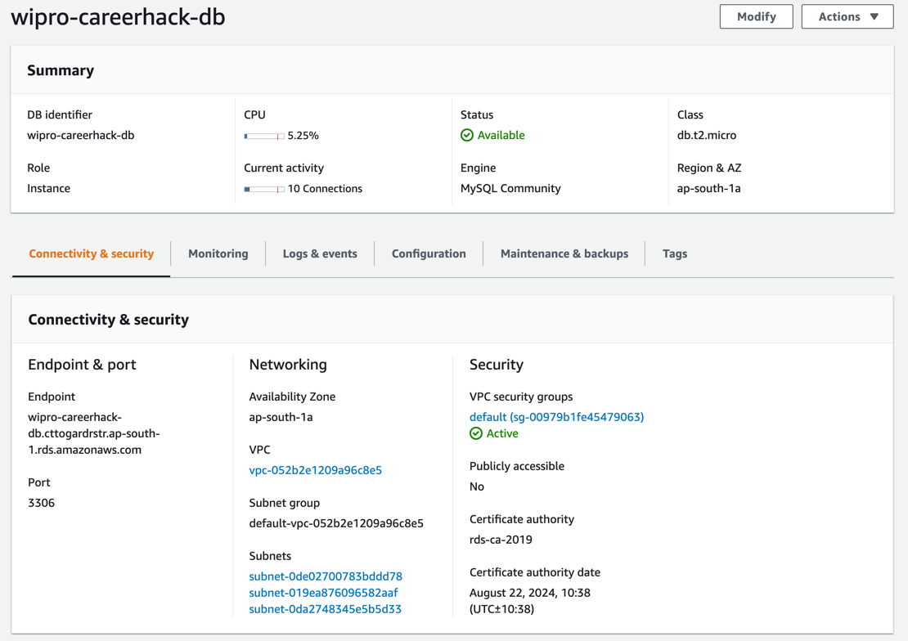
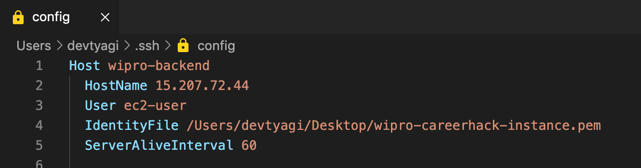
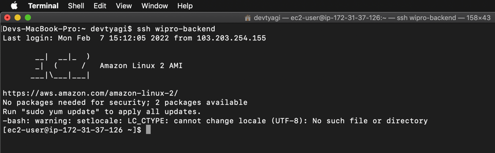
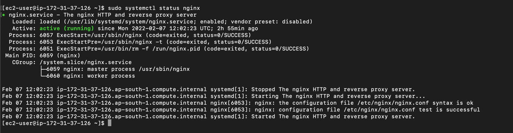
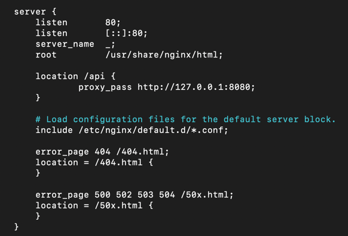

# WiproCareerHack-HackathonSubmission-Backend

User Management Microservice created as per the problem statement given in **Wipro CareerHack [India]: Java Spring Boot + AWS challenge** hosted by TopCoder.

https://www.topcoder.com/challenges/53963822-9016-400f-b418-6893463e5fb3

## Problem Statement

```
In this hackathon, you are required to create a service for User management. 
The functionalities involve User creation, User login including session management, User Deletion. 
This includes both, the frontend and backend.

The system involves a Java Spring Boot based microservice running on AWS EC2 or ECS with a backend SQL DB running on AWS RDS.
```

# Deployment

The project has been deployed on an Amazon EC2 t2.micro instance.
The app requires the following environment variables to be set:
- **Database (RDS)**
    - DB_HOST
    - DB_PORT
    - DB_NAME
    - DB_USER
    - DB_PASSWORD
- **Default User**    
    - ADMIN_EMAIL
    - ADMIN_PASSWORD
- **AWS Credentials (Can be configured via AWS CLI)**
    - AWS_ACCESS_KEY_ID
    - AWS_SECRET_ACCESS_KEY
    - AWS_REGION
    
### Creating JAR file

The following command creates a JAR executable file for the Backend.  

```mvn clean package```

### Setting up EC2

An EC2 instance has to be set up, with inbound rules for SSH (Own IP) and HTTP traffic.
'All Traffic' is allowed within the Security Group for allowing communications with RDS Database Instance.




### Setting up RDS Database

MySQL database RDS instance has been created in the same VPC as that of EC2 instance.



## Setting up SSH

SSH Config file has been edited for easy access.



Logging into the EC2 Instance using SSH



### Install JDK 11 on EC2

```sudo yum install java-11```

## Uploading JAR file to EC2

SCP (Secure Copy) is used to upload file to the remote server via SSH.

To be executed on Local System: 
```
scp -i ./Users/devtyagi/Desktop/wipro-careerhack-instance.pem ./user-service-0.0.1-SNAPSHOT.jar ec2-user@ec2-15-207-72-44.ap-south-1.compute.amazonaws.com:~
```

### Configure AWS CLI

```
curl "https://awscli.amazonaws.com/awscli-exe-linux-x86_64.zip" -o "awscliv2.zip"
unzip awscliv2.zip
sudo ./aws/install
```

```aws configure```

### Bash Script for Execution

A bash file has been created for executing the backend application in background.   
Logs will be stored in output.log file.

The background process ID will be saved in save_pid.txt file.

Filename: run-user-service.sh

```
#!/bin/sh

nohup java \
-DDB_NAME=wipro_careerhack_db \
-DDB_HOST=wipro-careerhack-db.cttogardrstr.ap-south-1.rds.amazonaws.com \
-DDB_PORT=3306 \
-DDB_USER=<db-user-here> \
-DDB_PASSWORD=<db-password-here> \
-DADMIN_EMAIL=admin@devtyagi.com \
-DADMIN_PASSWORD=<admin-password-here> \
-jar user-service-0.0.1-SNAPSHOT.jar > output.log & 

echo $! > save_pid.txt
```

Make the .sh file executable:   
```chmod +x run-user-service.sh```

Execute the Application:   

```./run-user-service.sh```

The backend application will now be running on PORT 8080.

### Install NGINX

The application runs on port 8080 by default. NGINX has been set up to proxy pass all requests on '/api' route port 80 (HTTP) to port 8080 (Spring Boot).

```sudo amazon-linux-extras enable epel```    

```sudo yum install epel-release```    

```sudo yum install nginx```

```
sudo systemctl start nginx
sudo systemctl enable nginx
sudo systemctl status nginx
```



### Setup NGINX Reverse Proxy

Edit the default nginx.conf file to proxy pass requests to port 8080.
We'll add the proxy pass for location '/api' on port 80.

```sudo nano /etc/nginx/nginx.conf```



Restart NGINX:   
```sudo systemctl restart nginx```


### Done!

The backend has been successfully deployed on the EC2 instance by following the above steps, it handles HTTP API requests on PORT 80.    
HTTPS was not set up since it was out of the Hackathon Scope
